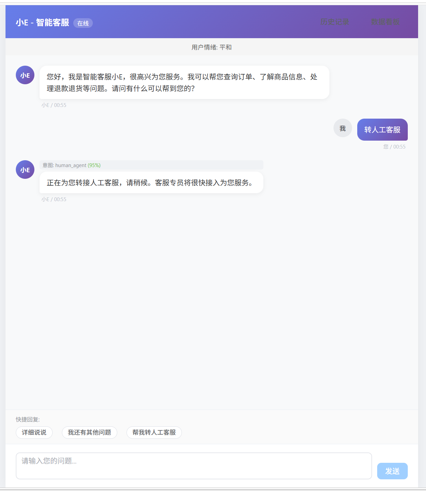
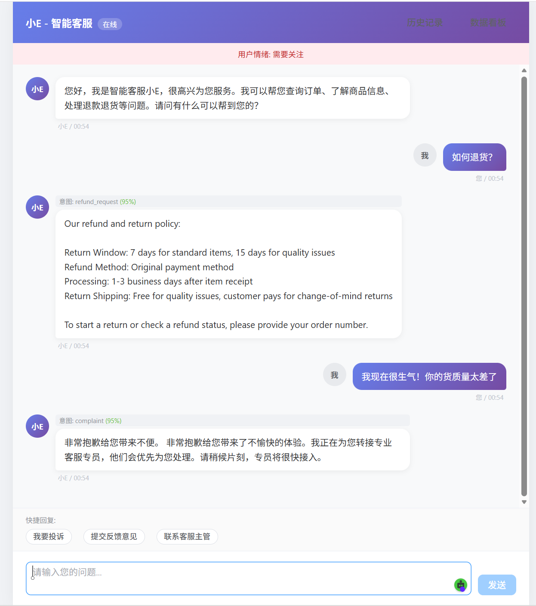
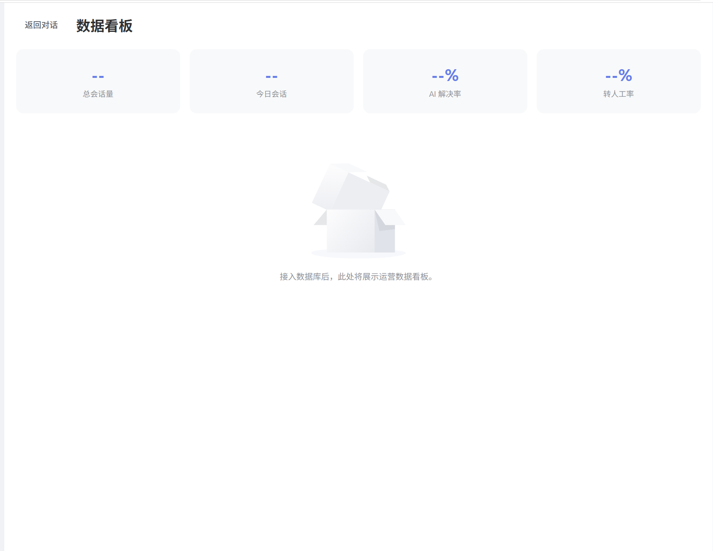

# 电商智能客服系统

一套生产级别的电商智能客服系统，融合大语言模型（LLM）、Agent 架构、检索增强生成（RAG）、自然语言理解（NLU）意图识别以及情感分析技术。系统能够精准理解用户意图，自动处理常见咨询问题，复杂问题无缝转人工，并支持多轮对话、个性化推荐和全链路数据分析。



## 系统架构概览

系统采用分层架构设计：

- **客户端层**: Vue 3 + TypeScript 单页应用，支持 WebSocket 实时通信
- **网关层**: Nginx 反向代理，支持 HTTPS、限流、WebSocket 升级
- **应用层**: FastAPI 异步后端，提供 REST 和 WebSocket 接口
- **AI 服务层**: 可切换 LLM 提供商（OpenAI / Anthropic / 本地模型）、Embedding 服务、RAG 引擎
- **数据层**: MySQL（业务数据）、Redis（缓存/会话）、Milvus（向量检索）、MinIO（文件存储）

## 核心特性

- 基于 NLU 的多策略意图识别（关键词 + 语义 + LLM 三级融合），准确率可达 95% 以上
- 实时情感分析，根据用户情绪触发差异化服务策略
- RAG 知识增强回答，连接企业知识库提供专业准确的业务解答
- Agent 自主决策架构，基于 ReAct 框架执行复杂多步骤任务
- 智能转人工机制，支持投诉自动升级和人工客服无缝接入
- 支持 SSE 流式回答，提升用户体验
- 多端适配: Web、移动 H5、微信小程序、企业微信
- 完整的运营数据分析看板

## 技术栈

| 层级 | 技术选型 |
|------|---------|
| 前端 | Vue 3, TypeScript, Pinia, Element Plus, Vite |
| 后端 | Python 3.11+, FastAPI, SQLAlchemy 2.0 (异步), Pydantic v2 |
| 数据库 | MySQL 8.0, Redis 7, Milvus 2.3 |
| AI/ML | 多提供商抽象（OpenAI / Anthropic / 本地 vLLM）, text-embedding |
| 部署 | Docker, Docker Compose, Nginx |

## 快速开始

### 环境要求

- Docker 和 Docker Compose v2
- Python 3.11+（本地开发）
- Node.js 20+（本地开发）
- LLM API 密钥（OpenAI、Anthropic 或兼容接口）

### 一键部署

```bash
# 克隆仓库
git clone https://github.com/your-org/ecommerce-customer-service.git
cd ecommerce-customer-service

# 配置环境变量
cp .env.example .env
# 编辑 .env 文件，填入 API 密钥和相关配置

# 启动所有服务
docker compose up -d

# 初始化数据库
docker compose exec backend python scripts/init_db.py

# 导入知识库样本数据
docker compose exec backend python scripts/import_knowledge.py
```

启动后访问:
- 前端页面: http://localhost:3000
- 后端 API: http://localhost:8000
- API 文档 (Swagger): http://localhost:8000/docs

### 本地开发

详细的本地开发环境搭建指南请参考 [部署指南](docs/DEPLOYMENT.md)。

## 项目结构

```
ecommerce-customer-service/
├── backend/                    # FastAPI 后端
│   ├── app/
│   │   ├── api/               # REST 和 WebSocket 路由
│   │   ├── core/              # 配置、安全认证、数据库连接
│   │   ├── models/            # SQLAlchemy ORM 数据模型
│   │   ├── schemas/           # Pydantic 请求/响应模型
│   │   ├── services/          # 业务逻辑服务层
│   │   ├── agents/            # Agent 实现和工具集
│   │   ├── nlu/               # 自然语言理解模块
│   │   ├── ml/                # 机器学习模块（情感分析、向量化）
│   │   ├── rag/               # RAG 检索增强生成管线
│   │   └── utils/             # 工具函数（日志、缓存、限流）
│   ├── tests/                 # 测试套件
│   ├── scripts/               # 数据库初始化和管理脚本
│   └── migrations/            # Alembic 数据库迁移（生产环境使用）
├── frontend/                   # Vue 3 前端
│   └── src/
│       ├── api/               # API 接口封装
│       ├── components/        # 可复用 UI 组件
│       ├── views/             # 页面级组件
│       ├── stores/            # Pinia 状态管理
│       ├── types/             # TypeScript 类型定义
│       └── utils/             # 工具函数
├── docker/                     # Docker 配置文件
├── docs/                       # 项目文档
├── config/                     # YAML 配置文件
├── scripts/                    # Shell 脚本
└── knowledge_base/             # 知识库样本数据
```

## 文档索引

- [架构设计文档](docs/ARCHITECTURE.md)
- [API 接口规范](docs/API_SPEC.md)
- [数据库设计文档](docs/DATABASE_SCHEMA.md)
- [部署指南](docs/DEPLOYMENT.md)

## 许可证

本项目采用 Apache License 2.0 许可证，详见 [LICENSE](LICENSE) 文件。
